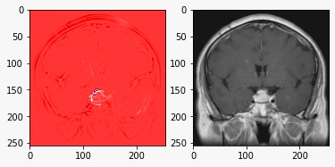
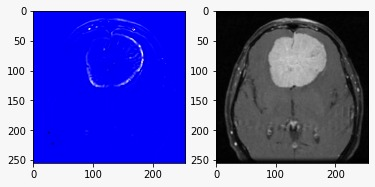
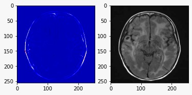

# Explaining Predictions: Brain MRI image regions responsible for cnacer detection
## Summary
- Part one of this project is to detect cancer type(no_tumor,glioma_tumor, meningioma_tumor,pituitary_tumor)
 using VGG16 pretrained model and runnig custom training on out Brain MRI dataset.
- Second part explains the regions in the MRI image that are mostly important for the classification of the images
- XAI of explainable AI for image data shows which inputs( pixels in images) are responsible for the prediction by the deep learning model
- In this case we have used **Layerwise Relevance Propagation (LRP)**
- For in dept study on implementation of LRP you can follow this:https://git.tu-berlin.de/gmontavon/lrp-tutorial

## Demo:
From the following images you observe which regions of the MRI images are responsible for the classification of our trained model:

